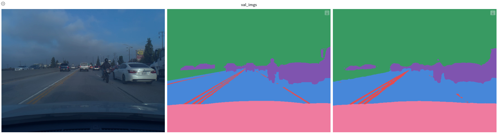
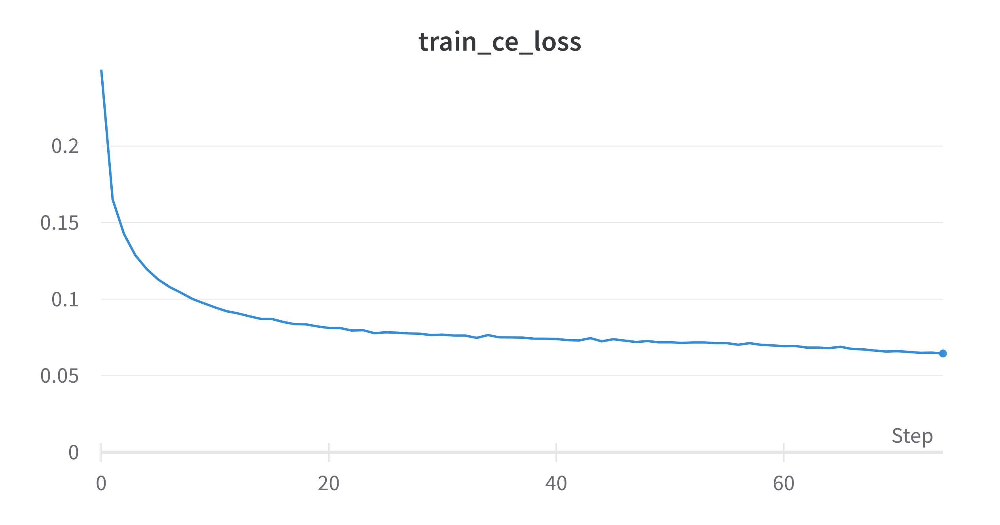
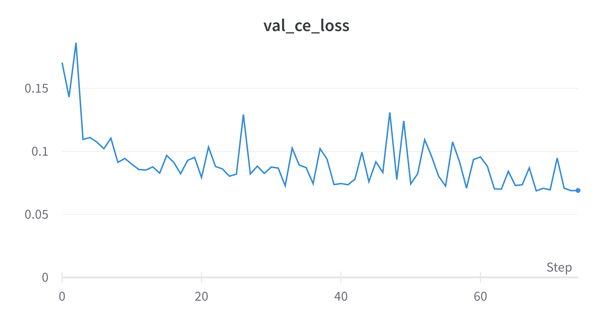
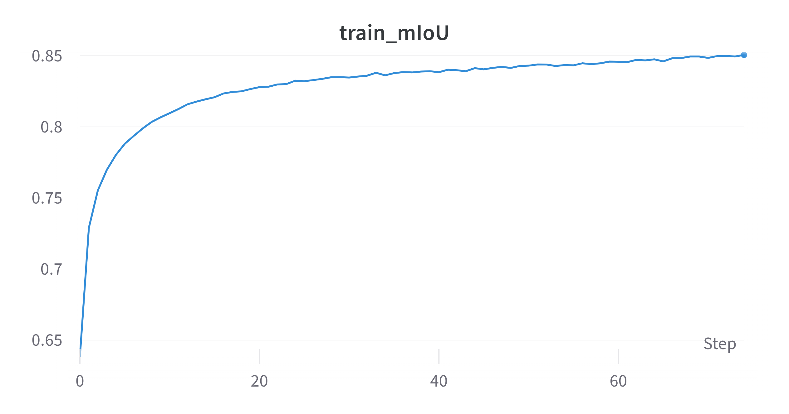
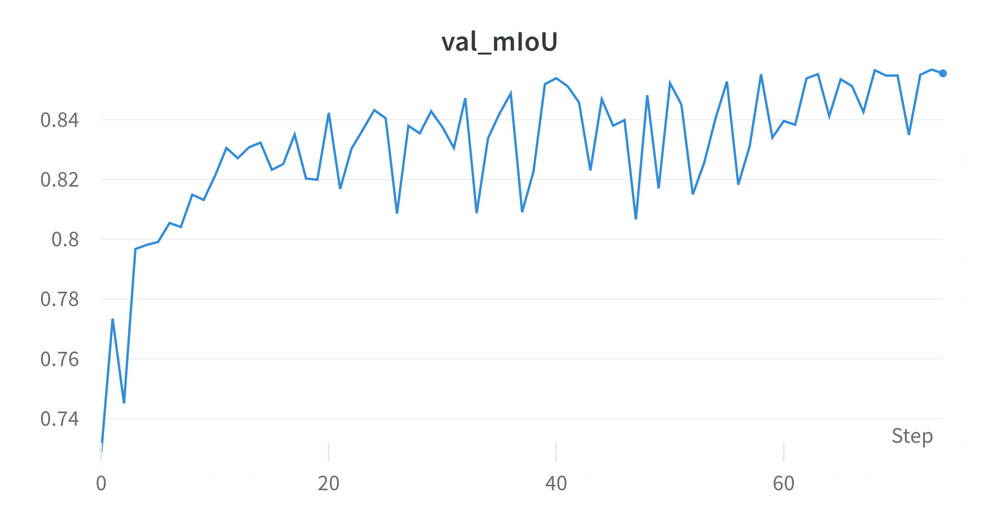

# comma10k-segnet
Training a semantic segmentation network on the comma10k dataset. This network is to be used to filter out dynamic objects when using visual odometry for the comma calibration challenge. The comma calib code can be found at my [calib_challenge repo](https://github.com/MartinEthier/calib_challenge).

## Dataset Setup
The dataset can be downloaded by cloning the comma10k repo. However, simply using git clone will result in an insane download time since we are downloaded each past commit. So limit the depth of the clone to 1 to speed it up:
```
git clone --depth 1 git@github.com:commaai/comma10k.git
```
The only things needed are the imgs and masks folders and the files_trainable file. Feel free to delete everything else.

## Training Setup
The config for my best run is deeplabv3plus.yaml. So to run this, just do:
```
python train.py configs/deeplabv3plus.yaml
```

## Best Model
My current best model achieves a cross-entropy loss of 0.068 with a validation mIoU of 0.857. Note that this model is trained on half-size images since I am limited on compute (single 8GB GPU). The config file used for this run is the deeplabv3plus.yaml file in the repo. Example predictions on the validation set are shown below:


Some training plots:




